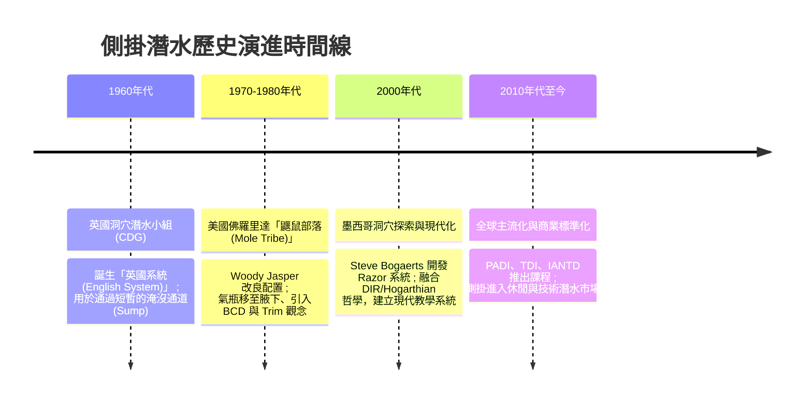

# 側掛潛水起源與歷史 (History & Origins of Sidemount Diving)

側掛潛水（Sidemount Diving）在今日已成為休閒與技術潛水的主流配置之一。然而，它的起源並非源於水下觀光或軍事用途，而是源於**英國乾洞探險家（Dry Cavers）在面對被水淹沒的通道（Sump）時，為了繼續探索而不得不發展出的極限自救技術**。

本篇將詳述側掛潛水如何從早期的「英國系統」一步步演進，經歷美國佛羅里達的改良、墨西哥洞穴的現代化，最終走入主流潛水界。

---

## ⏳ 歷史演進的四個關鍵階段

### 1. 第一階段：1960年代 英國的「泥濘與爬行」時代 (The English System)
*   **背景**：在英國（如薩默塞特 Mendip 丘陵的 Wookey Hole、約克郡 Dales 等洞區），許多乾洞探險家在深入地下數公里後，會遇到被水淹沒的段落，稱為**「虹吸通道」（Sump）**。為了能通過這段水路繼續探索後方的乾洞，他們必須攜帶潛水器材。
*   **早期配置（The English System）**：
    *   當時還沒有現代的 BCD，探險家使用一條堅固的織帶腰帶，並在腰部和大腿旁掛載小型氣瓶（通常為鐵瓶，約 3 到 5 公升）。
    *   由於洞穴通道極度狹窄，探險家需要在泥濘中爬行或在水中摸索前進。氣瓶掛在身側（而非背上）是為了能隨時解開、推至前方，以便擠過連身體都難以通過的狹窄縫隙。
    *   **核心特點**：此階段不注重「水中推進效率」或「精準浮力」，而是強調**陸上便攜性、防刮性與極限穿梭能力** [1][2]。

### 2. 第二階段：1970-1980年代 美國佛羅里達的「清水與長征」
*   **環境轉變**：當側掛概念傳入美國佛羅里達（Florida）時，當地的洞穴系統（如 Ginnie Springs, Peacock Springs）與英國截然不同。佛羅里達的洞穴水量充沛、能見度極高且水流強勁，需要長時間的游動與精確的浮力控制。
*   **鼴鼠部落（Mole Tribe）的改良**：
    *   以 **Woody Jasper**、**Wes Skiles**、**Lamar Hires** 等人為首的探險家（自稱 Mole Tribe）開始對英國系統進行大改造 [3][4]。
    *   **氣瓶上移**：Woody Jasper 發現將氣瓶掛在腰間會導致游動時雙腿下沉。他將氣瓶頂端（瓶閥處）利用彈性繩（Bungee）拉至腋下，瓶底則固定在臀部附近的D環。這使得氣瓶與人體完全平行，奠定了現代側掛的物理結構 [3]。
    *   **引入浮力補償**：為了在長距離游動中保持水平，他們開始改裝夾克式 BCD，將內膽拆下並貼合於背部，這也是現代側掛背囊（Bladder）的雛形 [3]。
*   **首款商用裝備**：1990年代中期，Dive Rite 的創辦人 Lamar Hires 根據這些改裝經驗，設計並推出了歷史上第一款商業量產的側掛背帶系統——**Transpac Harness** [1][4]。

### 3. 第三階段：2000年代 墨西哥的「極簡革命」與 Steve Bogaerts
*   **墨西哥 Cenotes 的發現**：尤卡坦半島的無底洞（Cenotes）擁有世界最長且錯綜複雜的淡水洞穴系統。當地的探索需要通過極度低矮的岩棚（Bedding planes）。
*   **Steve Bogaerts 與 Razor 系統**：
    *   來自英國的洞穴潛水員 **Steve Bogaerts** 在墨西哥探索時，感到當時的美式側掛裝備（如 Dive Rite Nomad）體積依然過於龐大。
    *   他將技術潛水界推崇的 **DIR (Doing It Right) / Hogarthian** 極簡哲學融入側掛，只使用一條一體成型的織帶，取消所有多餘的扣具，並開發了貼合背部的超薄三角氣囊，這就是著名的 **Razor Sidemount System** [5][6]。
    *   Bogaerts 建立了一套系統化的調整與訓練程序（Go Sidemount），首次將側掛從「洞穴探險家專用」轉化為「可複製的標準化潛水技巧」 [5][7]。

### 4. 第四階段：2010年代至今 走入大眾視野
*   隨著裝備的成熟與安全性的驗證，各大潛水培訓機構開始注意到側掛的潛力。
*   **2010年**，PADI 正式推出休閒側掛與技術側掛課程，隨後 TDI、IANTD 等技術潛水機構也標準化了各自的側掛訓練 [1][8]。
*   側掛因其「背部無負擔」、「雙氣瓶獨立冗餘」等安全優勢，從洞穴探險專用技術，正式普及至開放水域的休閒潛水與沉船潛水 [1][2]。

---

## 🔍 側掛發展史上的關鍵人物

| 人物 | 貢獻時期 | 歷史地位與主要貢獻 |
| :--- | :--- | :--- |
| **Jack Sheppard** | 1930-1940年代 | 英國洞穴潛水先驅。1935 年 Wookey Hole 首次探勘係由 Graham Balcombe、Penelope Powell 使用 Siebe Gorman 水面供氣硬式潛水裝完成；Sheppard 稍後則開發**自製的自給式呼吸裝置**，為後續將氣瓶移至身側、可拆解通過窄縫的「英式系統」奠定觀念基礎（早期非現代側掛幾何）。 |
| **Woody Jasper** | 1970-1980年代 | 美國佛羅里達傳奇探險家，將氣瓶拉至腋下，並整合夾克式 BCD，建立了現代側掛的平衡（Trim）基礎 [3]。 |
| **Lamar Hires** | 1990年代 | 創辦 Dive Rite，設計出第一代商用側掛系統 Transpac，推動了側掛裝備的商業化 [1][4]。 |
| **Steve Bogaerts** | 2000年代 | 開發 Razor 系統，將 Hogarthian 極簡風格引入側掛，奠定了當代英式極簡側掛（Minimalist Sidemount）的標準 [5][6]。 |

---

## 📚 參考文獻與引用來源

1. **Wikipedia** - *Sidemount diving*（History 章節）: 側掛從英國 Sump diving 到商業標準化課程的演進綜述。 [連結](https://en.wikipedia.org/wiki/Sidemount_diving)
2. **Scuba Tech Philippines (Andy Davis)** - *The History of Sidemount Diving*: Cave Diving Group (CDG) 早期 "English System" 及其演進細節的深入剖析。 [連結](https://scubatechphilippines.com/scuba_blog/history-of-sidemount-diving/)
3. **InDEPTH (GUE)** - *The Who's Who of Sidemount: Woody Jasper*: 佛州側掛之父 Woody Jasper 以單車內胎拉緊瓶頸、發展佛州式側掛的第一手歷史訪談。 [連結](https://indepthmag.com/sidemount-woody-jasper/)
4. **Adrex.com** - *Sidemount – History of the Diving Equipment Configuration*: 從 Mike Boone、Forrest Wilson 到 Lamar Hires 將探索用改裝裝備規格化為 Dive Rite 商品的歷史。 [連結](https://www.adrex.com/en/articles/water/scuba-diving/sidemount-history-of-the-diving-equipment-configuration/)
5. **Go Sidemount (Razor 官方)** - *Razor Go Side Mount*（官方站）: Steve Bogaerts 極簡主義側掛系統之原創理念。 [連結](https://razorgosidemount.com/)
6. **InDEPTH (GUE)** - *A Brief History of Sidemount*: 墨西哥 Cenotes 探索對現代極簡側掛發展的影響與流派系譜。 [連結](https://indepthmag.com/a-brief-history-of-sidemount/)
7. **InDEPTH (GUE)** - *The Who's Who of Sidemount: Lamar Hires*: 首套商業側掛系統設計者、NSS-CDS 首份側掛專長課程作者之訪談。 [連結](https://indepthmag.com/sidemount-lamar-hires/)
8. **TDI/SDI** - *Sidemount Diving: It's Not Just for Caves*: 技術潛水協會將側掛標準化、推向開放水域訓練的歷程。 [連結](https://www.tdisdi.com/tdi-diver-news/sidemount-diving-its-not-just-for-caves/)

> ⚠️ 引用注意：indepthmag.com 與 tdisdi.com 有反爬蟲機制（403），內容以搜尋引擎索引確認。
