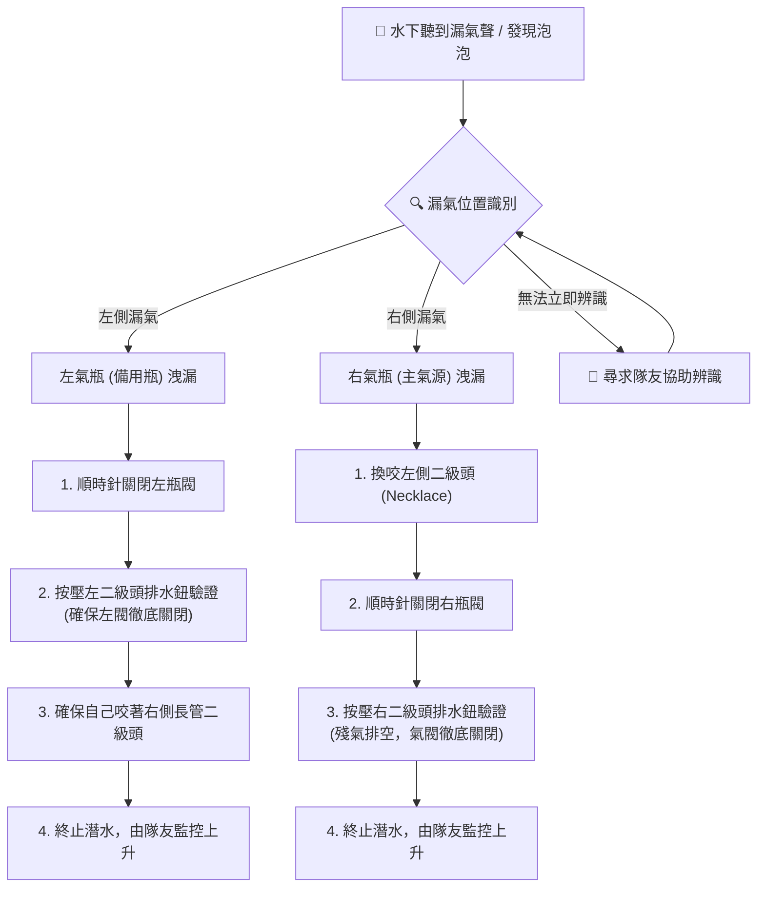

# 氣閥演練 (Valve Drills) 標準步驟 (Sidemount Valve Drill SOP)

氣閥演練（Valve Drill）是側掛潛水員最核心、最不可或缺的安全技術。其主要目的是**在水下遭遇氣體洩漏（如一級頭 O-ring 爆裂、低壓管爆管、二級頭持續漏氣）時，建立極快且精確的肌肉記憶，在數秒內獨立關閉受損氣瓶的氣閥以保住氣體** [1][2]。

本篇將詳述左右側氣閥的物理關閉方向、標準演練步驟（SOP），以及「完全開啟、不回轉」的現代安全標準與其原因。

---

## 🔄 左右氣閥的物理旋轉方向 (Valve Rotation Direction)

側掛潛水員必須對氣閥的旋轉方向形成直覺反射，防止在水下恐慌時「越開漏越大」：

*   **關閉方向：順時針 (Clockwise - CW)**。無論是左側氣瓶還是右側氣瓶，關閥的物理方向皆為順時針旋轉 [1][2]。
*   **開啟方向：逆時針 (Counter-Clockwise - CCW)**。兩側氣瓶的開啟物理方向皆為逆時針旋轉 [2]。
*   **記憶訣竅（Righty-Tighty, Lefty-Loosey）**：向右旋轉（順時針）為鎖緊關閉，向左旋轉（逆時針）為鬆開開啟。將手伸向腋下摸到手輪時，**手掌向後方（屁股方向）撥動為關閉；手掌向前方（前胸方向）撥動為開啟** [2][3]。

---

## 📐 側掛氣閥演練標準步驟 (Valve Drill SOP)

演練應在水平 Trim 與中性浮力穩定的狀態下進行，整個過程中**雙眼應直視前方，與潛伴維持視覺接觸** [1][2][7]：

```
步驟 1: 團隊溝通與訊號 ──> 步驟 2: 穩定 Trim ──> 步驟 3: 右側關閥演練 (主氣源)
向隊友做出 Valve Drill      在水中靜態懸停，          切換至左側二級頭；關閉右瓶閥；
手勢，獲得確認 [3]。        準備雙手盲摸 [2]。        Breathe down 驗證；逆時針完全重開。
                                                            │
                                                            ▼
步驟 5: 流程確認 (Flow Check) <── 步驟 4: 左側關閥演練 (備用氣源) ◄┘
看壓力錶確認，重置電腦錶，        切換回右側長管；關閉左瓶閥；
向隊友做出 OK 手勢 [8][9]。       按壓排水鈕驗證；逆時針完全重開。
```

### 步驟 1：團隊溝通與訊號 (Signaling)
向潛伴做出 "Valve Drill" 手勢（單手成握拳狀，模擬轉動閥門的動作），得到潛伴的「OK」確認手勢。潛伴會移動到您的斜前方，全程監控您的浮力並準備在有需要時提供氣體 [3][5]。

### 步驟 2：穩定 Trim 與浮力 (Stabilize)
深吸一口氣，建立穩定的中性浮力，手抱胸前方（V字形），維持水平 Trim 姿態 [1][7]。

### 步驟 3：右側氣閥演練 (Right Valve Shutdown - 呼吸中)
1.  **切換呼吸源**：右手從頸圈（Necklace）取出左側備用二級頭，排水（Purge）後咬入口中呼吸。同時，將右側主二級頭（長管）吐出，拉順長管以防纏繞 [2][5]。
2.  **摸閥定位**：右手向後下方摸索右腋下的一級頭與瓶閥手輪 [2]。
3.  **快速關閥**：以**順時針方向**快速且連續地旋轉手輪，直至完全關閉。
4.  **隔離驗證 (Breathe Down)**：拿起剛剛吐出的右側長管二級頭，按壓排水鈕（或吸一口氣），確認**管內殘氣完全排空，且調節器鎖死吸不出氣體**。這一步確認了右瓶閥已被徹底關死 [4][5]。
5.  **完全開啟**：以**逆時針方向**將右瓶閥完全旋開到底。**現代技術潛水標準為「完全開啟、不回轉」**（GUE 與多數技術機構之現行教法），不要再往回轉（理由見下節） [4][5][8]。

### 步驟 4：左側氣閥演練 (Left Valve Shutdown - 備用)
1.  **切換回主供氣**：將左側二級頭吐出掛回頸圈，咬回右側長管二級頭恢復呼吸。
2.  **摸閥定位**：左手向後下方摸索左腋下的瓶閥手輪 [2]。
3.  **快速關閥**：以**順時針方向**旋轉手輪，直至完全關閉。
4.  **隔離驗證**：按壓胸前項圈左二級頭的排水鈕，確認殘氣排空且無氣流噴出，確認左瓶閥完全關閉 [2][4]。
5.  **完全開啟**：以**逆時針方向**完全旋開左瓶閥到底，**同樣維持完全開啟、不回轉** [4][8]。

### 步驟 5：流程檢查與確認 (Flow Check)
確認兩側氣瓶皆已重新開啟。看一眼左右兩側的壓力錶（SPG）確認數值，向潛伴做出「OK」手勢，結束演練 [8][9]。

### 🛡️ 實戰氣閥故障排除決策樹 (Mermaid Troubleshooting Tree)
以下為水下實際遭遇氣體洩漏（爆管/持續 freeflow）時的閥門隔離決策程序：



---

## ⚙️ 「完全開啟、不回轉」— 現代標準與過時做法的釐清

> ⚠️ **重要更正**：早期技術潛水曾教「完全旋開後再往回轉 1/4 圈」。**此為過時做法，現已不建議**。GUE 與多數現代技術機構（含 TDI 新版教材）現行標準為「**完全旋開到底，不回轉，並維持整潛全開**」 [4][5][8]。

過去回轉的兩個理由，在現代裝備與事故檢討後均已被推翻或反證：

1.  **「防止高壓鎖死」已不成立**：早期回轉的原意是防止舊式閥座被旋到底卡死。**現代閥（DIN/Pro valve）的螺紋與閥座設計已不會因完全開啟而鎖死**，無須預留回轉行程 [5][8]。
2.  **回轉反而製造致命誤判（核心安全理由）**：
    *   若閥門「完全開啟（轉不動）」，檢查者一扭發現轉不動，正確結論應是「已全開」。
    *   但若依舊做法回轉了半圈/一圈，閥門**左右都有自由行程**，檢查者無法分辨它是「全開後回轉」還是「全關後開一點」。一旦檢查者誤判為關閉而「先關死再開一點點」，潛水員就會帶著**半開閥**下水——深處流量不足、吸不到氣，比完全關閉更難察覺、更致命 [5][8]。
    *   因此現代共識：**全開到底、不留行程**，讓「轉不動 = 全開」成為唯一且明確的訊號。

> 📌 配套要求：因為閥門全開到底，下水前的 **Flow Check** 與泡泡檢查更顯重要（見 [[潛水前檢查清單 (Pre-dive Checklists)|潛水前檢查清單]]）。檢查時確認手輪「逆時針已轉不動」即代表完全開啟。

---

## 📚 參考文獻與引用來源

1. **TDI（官方標準）** - *TDI Diver Standards: Sidemount Diver*（現行版 PDF）: 關閥/氣閥操作為課程必修技能之定位、演練要求與安全步驟。 [連結](https://www.tdisdi.com/wp-content/uploads/files/sandp/currentYear/TDI/part%202/pdf/individual/TDI%20Diver%20Standards_05_Sidemount.pdf)
2. **FlowState Divers (Master Series)** - *The Sidemount Valve Drill*: 詳細步驟拆解、Breathe down 驗證邏輯與左右側對稱訓練。 [連結](https://www.flowstatedivers.com/master-series/the-sidemount-valve-drill)
3. **ScubaBoard** - *left/right valves?*: 潛水社群針對左右閥鏡像旋轉方向與「Righty tighty」防呆口訣在雙瓶情境的討論（社群來源，僅供補充）。 [連結](https://scubaboard.com/community/threads/left-right-valves.320315/)
4. **SWT (South West Technical, Ireland)** - *Twinset Valve Drill*: 技潛氣閥演練的流程拆解、水平 Trim 前提與常見錯誤。 [連結](https://swt.ie/2020/07/26/valvedrill/)
5. **GUE (Global Underwater Explorers)** - *General Training Standards, Policies, and Procedures v10.1*（官方 PDF）: GUE 系統下 valve drill 要求、「氣閥完全開啟、不回轉」之現行標準與團隊訊號配合。 [連結](https://www.gue.com/files/Standards_and_Procedures/GUE-Standards-v10.1.pdf)
6. **Doppler's Tech Diving Blog (Steve Lewis)** - *Getting Sidemount Tanks to Behave Themselves and Sit Where They Should*: 診斷因 Bungee 張力/瓶帶位置不當導致水下摸不到氣閥的調整方案。 [連結](https://decodoppler.wordpress.com/2015/02/03/625/)
7. **NSS-CDS（官方標準）** - *NSS-CDS Standards and Procedures*（現行版 PDF）: 洞穴訓練中關閥演練、防揚沙與姿態控制之評核標準。 [連結](https://nsscds.org/wp-content/uploads/2022/11/Standards221127.pdf)

> ⚠️ 引用注意：tdisdi.com 有反爬蟲機制（403），標準 PDF 以搜尋引擎索引確認。
