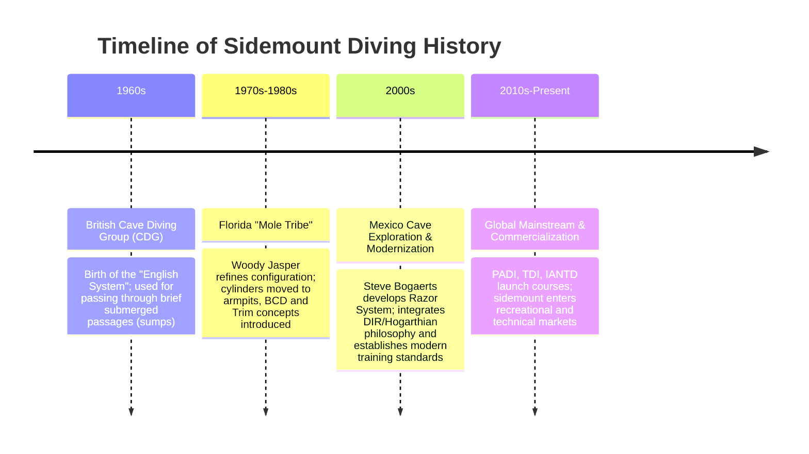

# Sidemount Origins & History (History & Origins of Sidemount Diving)

Sidemount diving has become one of the mainstream configurations in recreational and technical diving today. However, its origins did not arise from underwater sightseeing or military applications. Instead, it was born as an **extreme self-rescue technique developed by British dry cavers who had to pass through submerged cave passages (sumps) to continue their underground explorations**.

This article details how sidemount diving evolved from the early "British System," underwent modifications in Florida, was modernized in Mexico, and ultimately entered mainstream diving.

---

## ⏳ Four Key Stages of Historical Evolution

### 1. First Stage: 1960s - The British "Mud & Crawl" Era (The English System)
*   **Background**: In the United Kingdom (e.g., Wookey Hole in Somerset Mendip Hills, Yorkshire Dales), dry cavers exploring underground systems encountered submerged sections called **"sumps."** To pass through these sumps and continue exploring dry caves beyond, they had to carry diving equipment.
*   **Early Setup (The English System)**:
    *   Since modern BCDs did not exist, cavers used a heavy webbing belt to mount small cylinders (typically steel, 3 to 5 liters) along their hips and thighs.
    *   Because cave passages were extremely tight and muddy, cavers had to crawl or feel their way through. Mounting cylinders on the side (rather than on the back) allowed them to unclip and push the cylinders ahead of them to squeeze through restrictions narrower than their bodies.
    *   **Core Feature**: This stage did not focus on "underwater propulsion efficiency" or "precise buoyancy control." Instead, it prioritized **dry cave portability, abrasion resistance, and extreme restriction passage** [1][2].

### 2. Second Stage: 1970s-1980s - Florida's "Clear Water & Long Range"
*   **Environmental Shift**: When the sidemount concept reached Florida, explorers faced a very different cave environment (e.g., Ginnie Springs, Peacock Springs). Florida caves featured high flow, extreme visibility, and vast chambers, requiring long swims and precise buoyancy control.
*   **Refinements by the "Mole Tribe"**:
    *   Explorers like **Woody Jasper**, **Wes Skiles**, and **Lamar Hires** (calling themselves the "Mole Tribe") overhauled the British system [3][4].
    *   **Cylinders Shifted Up**: Woody Jasper realized that hanging cylinders at the hips caused a diver's legs to sink during swimming. He secured the cylinder neck (valve) under the armpits using elastic shock cords (bungees) and clipped the cylinder bottom to D-rings near the hips. This kept cylinders parallel to the torso, defining the physical structure of modern sidemount [3].
    *   **Buoyancy Compensation**: To maintain a horizontal trim during long swims, they modified jacket-style BCDs by removing the inner bladders and strapping them to the back. This served as the prototype of modern sidemount wings (bladders) [3].
*   **First Commercial Gear**: In the mid-1990s, Lamar Hires, founder of Dive Rite, designed and launched the first commercially mass-produced sidemount harness system based on these custom rigs—the **Transpac Harness** [1][4].

### 3. Third Stage: 2000s - Mexico's "Minimalist Revolution" & Steve Bogaerts
*   **Discovery of Mexican Cenotes**: The Yucatan Peninsula's cenotes feature the world's longest and most intricate freshwater cave networks. Exploring these systems required passing through extremely low bedding planes.
*   **Steve Bogaerts & the Razor System**:
    *   British cave diver **Steve Bogaerts** found that American sidemount gear of the era (like the Dive Rite Nomad) remained too bulky for Mexican restrictions.
    *   He integrated the **DIR (Doing It Right) / Hogarthian** minimalist philosophy of technical diving into sidemount. He utilized a single continuous webbing harness, removed unnecessary hardware, and developed a flat, triangular wing positioned close to the back—the famous **Razor Sidemount System** [5][6].
    *   Bogaerts established a systematic rigging and training methodology (Go Sidemount), transforming sidemount from "caver-only custom rigs" into a "reproducible, standardized diving technique" [5][7].

### 4. Fourth Stage: 2010s-Present - Mainstream Adoption
*   As equipment matured and safety was proven, major training agencies recognized the potential of sidemount.
*   In **2010**, PADI officially launched recreational and technical sidemount courses, followed by standardization of training by TDI, IANTD, and other technical diving agencies [1][8].
*   With safety advantages such as "relieving back strain" and "true cylinder redundancy," sidemount transitioned from a niche cave-diving technique into a popular choice for open-water recreational and wreck diving [1][2].

---

## 🔍 Key Historical Figures in Sidemount Development

| Figure | Era | Historical Role & Contributions |
| :--- | :--- | :--- |
| **Jack Sheppard** | 1930s-1940s | British cave diving pioneer. In 1935, Wookey Hole was first explored using surface-supplied Siebe Gorman standard dress by Graham Balcombe and Penelope Powell. Sheppard later developed **custom self-contained breathing apparatus**, laying the conceptual groundwork for unclipping cylinders to pass through restrictions (early precursor to sidemount geometry). |
| **Woody Jasper** | 1970s-1980s | Legendary Florida explorer who secured cylinder necks under the armpits and integrated jacket BCD bladders, establishing the foundation of modern sidemount trim [3]. |
| **Lamar Hires** | 1990s | Founder of Dive Rite. Designed the first commercial sidemount system, the Transpac, driving commercialization of the configuration [1][4]. |
| **Steve Bogaerts** | 2000s | Developer of the Razor system. Introduced Hogarthian minimalism to sidemount, setting the standard for modern minimalist sidemount [5][6]. |

---

## 📚 References

1. **Wikipedia** - *Sidemount diving* (History Section): Overview of sidemount evolution from British sump diving to commercial standardized courses. [Link](https://en.wikipedia.org/wiki/Sidemount_diving)
2. **Scuba Tech Philippines (Andy Davis)** - *The History of Sidemount Diving*: In-depth analysis of the Cave Diving Group (CDG) early "English System" and its evolution. [Link](https://scubatechphilippines.com/scuba_blog/history-of-sidemount-diving/)
3. **InDEPTH (GUE)** - *The Who's Who of Sidemount: Woody Jasper*: First-hand interview with the father of Florida sidemount, Woody Jasper, detailing his use of bicycle inner tubes to secure cylinder necks. [Link](https://indepthmag.com/sidemount-woody-jasper/)
4. **Adrex.com** - *Sidemount – History of the Diving Equipment Configuration*: The transition of exploratory custom rigs to standardized specifications like Dive Rite products. [Link](https://www.adrex.com/en/articles/water/scuba-diving/sidemount-history-of-the-diving-equipment-configuration/)
5. **Go Sidemount (Razor Official)** - *Razor Go Side Mount* (Official Site): Original philosophy of Steve Bogaerts' minimalist sidemount system. [Link](https://razorgosidemount.com/)
6. **InDEPTH (GUE)** - *A Brief History of Sidemount*: The impact of Mexican Cenotes exploration on modern minimalist sidemount and its lineage. [Link](https://indepthmag.com/a-brief-history-of-sidemount/)
7. **InDEPTH (GUE)** - *The Who's Who of Sidemount: Lamar Hires*: Interview with the designer of the first commercial sidemount system and author of the first NSS-CDS sidemount specialty course. [Link](https://indepthmag.com/sidemount-lamar-hires/)
8. **TDI/SDI** - *Sidemount Diving: It's Not Just for Caves*: Technical diving agency's process of standardizing sidemount and introducing it to open water training. [Link](https://www.tdisdi.com/tdi-diver-news/sidemount-diving-its-not-just-for-caves/)

> ⚠️ Note on Citations: indepthmag.com and tdisdi.com employ anti-scraping mechanisms (403); contents verified via search engine index.
