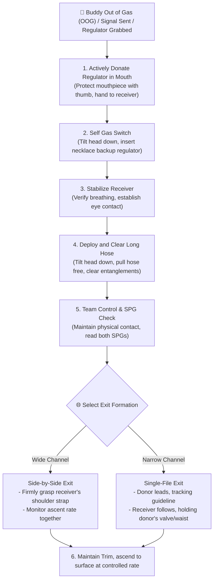

# Out of Gas (OOG) & Long Hose Sharing Procedure (Out of Gas & Long Hose Donation)

An Out of Gas (OOG) emergency is the most immediate life-safety hazard in diving. In technical sidemount configurations, the **2.1-meter (7 ft) long hose** mounted on the right cylinder is the primary gas-sharing tool.

This article details the philosophy of long-hose donation, standard operating procedures (SOPs) for active donation in sidemount, and buddy exit formations for open and confined water.

---

## 🧠 Philosophy of Long Hose Donation

In technical and sidemount diving, OOG emergencies are managed using the **"Active Donation of the Regulator in Your Mouth"** philosophy:

1.  **Instinctive Behavior Management**: When a diver runs out of gas, panic triggers an instinct to rush toward the closest buddy and **grab the regulator in their mouth—the one currently breathing and proven to work** [1][2]. Rather than allowing a panicked grab to cause chaos, the donor actively and calmly hands over their breathing regulator.
2.  **Single-File Exit (Overhead Environments)**: A standard recreational backup regulator (octopus) is only about 1 meter long. Sharing gas on a 1m hose requires the two divers to swim side-by-side. **In tight overhead restrictions, side-by-side swimming is physically impossible**.
    *   A 2.1-meter long hose provides enough separation for the two divers to swim **single-file** through narrow restrictions, with the donor leading the way and the receiver following closely behind [2][3][4].

---

## 📐 Sidemount Long Hose Donation SOP

When a teammate signals "OOG" (slashing hand across the neck) or approaches you in distress, execute the following steps [3][4][5]:

```
Step 1: Donate Active Regulator ───> Step 2: Switch to Backup ───> Step 3: Deploy & Clear Long Hose
Grasp right second stage,           Tilt head down, locate       Once receiver is breathing,
spit it out, and hand it to         bungee necklace regulator,   pull the long hose free from
receiver, mouthpiece facing them.   insert it, and breathe.      around your neck and clear wraps [2][5].
```

1.  **Step 1: Active Donation**:
    *   Grasp the right-side regulator you are breathing. Place your thumb under the mouthpiece box to protect it, spit it out, and hand it directly to the receiver, ensuring the mouthpiece is oriented toward their mouth [4].
2.  **Step 2: Self-Gas Switch**:
    *   While donating the right regulator, tilt your head down, reach for your neck bungee, insert the left backup regulator into your mouth, purge it, and resume breathing [3][5].
3.  **Step 3: Deploy and Clear Long Hose**:
    *   Once the receiver is breathing and calm, tilt your head down, reach behind your neck, and pull the long hose free, allowing it to fully deploy.
    *   **Clear Wraps**: Trace the hose to ensure the 2.1m line is not snagged on your camera, primary light canister, harness buckles, or BCD inflator [2][5].
4.  **Step 4: Establish Team Contact**:
    *   Grasp the receiver's harness shoulder strap (maintaining physical contact), check their SPG pressure, establish eye contact, and verify they are stable.

---

## 🏊 Share-Air Exit Formations

Depending on the size of the environment, choose one of the following exit formations:

### 🟢 Formation 1: Side-by-Side — Wide Spaces
*   **Positioning**: Divers swim side-by-side, maintaining horizontal Trim.
*   **Contact**: The donor uses their left (or right) hand to hold the receiver's shoulder strap, leaving the other hand free to steer or manage buoyancy.
*   **Benefit**: Allows the donor to monitor the receiver's stress levels and coordinate ascent rates [3][6].

### 🔴 Formation 2: Single-File — Confined Restrictions
*   **Positioning**: Divers swim one in front of the other through restrictions [3][6].
*   **Donor Leads**: The donor swims in front, managing the guideline, primary light, and navigation.
*   **Receiver Follows**: The receiver swims behind, holding the donor's **cylinder valve, waist harness, or thigh** to maintain contact.
*   **Hose Routing**: The long hose runs from the receiver's mouth forward to the donor's right first stage. The excess hose floats naturally in a gentle arc between the divers, keeping it clear of the ceiling and floor [3][6][7].

### 🛡️ Long Hose Donation & Share-Gas Ascent Sequence



---

## 📚 References

1. **DAN (Divers Alert Network)** - *Avoiding Panic After Regulator Failure*: Analysis of panic behavior underwater (regulator/mask ripping, rapid ascents) and how to manage the panic loop. [Link](https://dan.org/alert-diver/article/avoiding-panic-after-regulator-failure/)
2. **Sidemount Book (Rob Neto)** - *Sidemount Diving: The Almost Comprehensive Guide* (Official Site): History and safety reasons for the 2.1-meter long hose setup in technical and sidemount diving. [Link](https://www.sidemountbook.com)
3. **TDI/SDI** - *Keeping Your Hose in Line*: Hose routing (over chest, around neck), S-drill donation flows, and the safety benefits of single-file exit lines. [Link](https://www.tdisdi.com/sdi-diver-news-id/keeping-your-hose-in-line/)
4. **GUE (Global Underwater Explorers)** - *General Training Standards, Policies, and Procedures v10.1* (PDF): Standard operating procedures for long hose deployment drills (S-drill) and shared ascents. [Link](https://www.gue.com/files/Standards_and_Procedures/GUE-Standards-v10.1.pdf)
5. **ScubaBoard Forum** - *Sidemount - why only one long hose?*: Community discussion on sidemount long hose count, neck wrapping, and donation protocols (community source for reference). [Link](https://scubaboard.com/community/threads/sidemount-why-only-one-long-hose.654843/)
6. **ProTec Dive Centers** - *Equipment & Configuration*: Over-shoulder long hose routing, immediate release of 1.2–1.5m during donation, and single-file team exit practices. [Link](https://protecdivecenters.com/blog/equipment-configuration/)
7. **YouTube (Garry Dallas / Simply Sidemount)** - *Dive Tips: Deploying Your Long Hose*: Video demonstration of sidemount long hose deployment and sharing drills (video source for reference). [Link](https://www.youtube.com/watch?v=mykuDy_eWJg)

> ⚠️ Note on Citations: Source [3] from tdisdi.com employs anti-scraping mechanisms (403); contents verified via search engine index.
