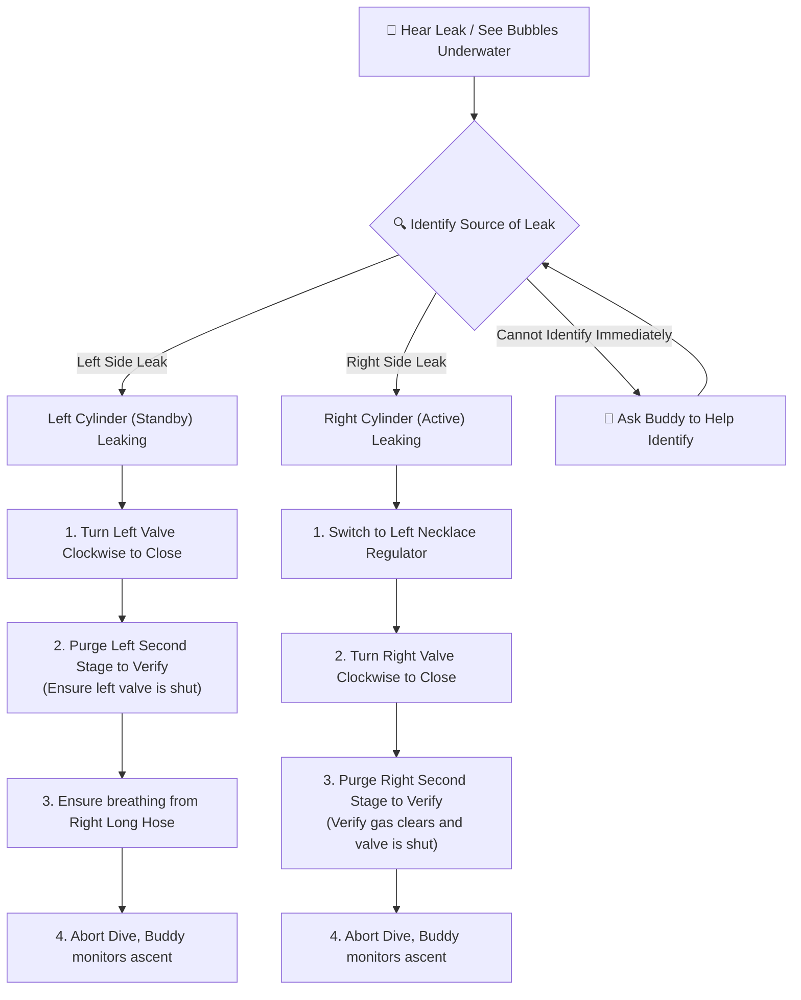

# Valve Drills Standard Operating Procedures (Sidemount Valve Drill SOP)

The valve drill is the most fundamental and critical safety skill for a sidemount diver. Its primary purpose is to **build rapid, precise muscle memory so that if an underwater gas leak occurs (e.g., a blown first stage O-ring, burst low-pressure hose, or regulator free-flow), the diver can independently isolate and shut down the compromised cylinder valve within seconds to preserve breathing gas** [1][2].

This article details the physical rotation direction of left and right valves, standard valve drill procedures (SOP), and the modern safety consensus of opening valves completely without turning back.

---

## 🔄 Physical Valve Rotation Direction

Sidemount divers must develop an instinctive reflex for valve rotation to prevent turning a leaking valve the wrong way under stress:

*   **To Close: Clockwise (CW)**. Regardless of whether it is the left or right cylinder, the physical direction to close the valve is clockwise [1][2].
*   **To Open: Counter-Clockwise (CCW)**. The physical direction to open both cylinder valves is counter-clockwise [2].
*   **Memory Aid (Righty-Tighty, Lefty-Loosey)**: Rotating to the right (clockwise) tightens and closes; rotating to the left (counter-clockwise) loosens and opens. When reaching back to grasp the handwheel, **pushing your palm backward (toward your hips) closes the valve; pulling your palm forward (toward your chest) opens it** [2][3].

---

## 📐 Sidemount Valve Drill Standard Operating Procedure (SOP)

The drill must be executed while maintaining a stable horizontal Trim and neutral buoyancy. Throughout the drill, **look straight ahead and maintain visual contact with your buddy** [1][2][7]:

```
Step 1: Signal Buddy ──> Step 2: Establish Hover ──> Step 3: Right Valve Shutdown (Active)
Signal "Valve Drill"     Maintain stable hover,        Switch to left necklace regulator;
to buddy; obtain OK [3]. prep for blind touch [2].     close right valve; purge right to verify;
                                                       re-open fully counter-clockwise.
                                                                 │
                                                                 ▼
Step 5: Final Flow Check <── Step 4: Left Valve Shutdown (Standby) ◄┘
Verify SPGs, reset computers,   Switch back to right regulator; close left valve;
signal OK to buddy [8][9].      purge left to verify; re-open fully counter-clockwise.
```

### Step 1: Signal Buddy
Signal "Valve Drill" to your buddy (using a closed fist rotating back and forth, simulating turning a valve handwheel), and obtain an "OK" confirmation. The buddy will position themselves in front of you, monitoring your buoyancy and standing by to share gas if needed [3][5].

### Step 2: Establish Hover & Trim
Take a breath to stabilize neutral buoyancy, bring your hands in front of your chest (forming a V-shape), and maintain a clean horizontal Trim [1][7].

### Step 3: Right Valve Shutdown (Active Cylinder)
1.  **Switch Regulators**: Reach for the left backup regulator on your neck bungee, purge, and insert it. Spit out the right primary regulator (long hose), routing it cleanly to prevent snags [2][5].
2.  **Locate Handwheel**: Reach back with your right hand to locate the right cylinder first stage and valve handwheel [2].
3.  **Shut Down**: Rotate the handwheel **clockwise** rapidly and continuously until it stops, closing the valve completely.
4.  **Isolate & Verify (Breathe Down)**: Grasp the right primary second stage you just spat out, and press the purge button (or take a breath). Verify that **all residual gas clears and no further gas flows**. This confirms the right valve is completely shut [4][5].
5.  **Re-Open**: Rotate the handwheel **counter-clockwise** until it is fully open. **Modern technical diving standards mandate opening the valve completely without backing off the wheel** (current standard for GUE and most technical agencies) [4][5][8].

### Step 4: Left Valve Shutdown (Standby Cylinder)
1.  **Switch Back**: Spit out the left regulator, return it to its neck bungee, insert the right primary regulator (long hose), and resume breathing.
2.  **Locate Handwheel**: Reach back with your left hand to locate the left cylinder valve handwheel [2].
3.  **Shut Down**: Rotate the handwheel **clockwise** until it is completely closed.
4.  **Isolate & Verify**: Press the purge button on the left necklace regulator, verifying that all residual gas clears and no further flow occurs [2][4].
5.  **Re-Open**: Rotate the handwheel **counter-clockwise** until it is fully open, **maintaining the fully open, no-turnback standard** [4][8].

### Step 5: Final Flow Check
Verify that both valves are fully open. Read the pressure gauges (SPGs) on both sides to confirm gas pressure, signal "OK" to your buddy, and conclude the drill [8][9].

---

### 🛡 Underwater Valve Isolation Decision Tree

Use this diagnostic sequence if you hear a leak or see bubble streams underwater:



---

## ⚙ "Fully Open, No Turnback" — Modern Standard vs. Outdated Practice

> ⚠️ **Important Correction**: Older training manuals taught divers to "open the valve completely, then turn it back 1/4 turn." **This is an obsolete practice and is no longer recommended**. Current training standards for GUE, TDI, and other modern technical agencies mandate: **open the valve completely until it stops, and leave it there** [4][5][8].

The two historical justifications for backing off the handwheel have been disproven by modern equipment and accident analyses:

1.  **"High-Pressure Lock" is no longer an issue**: Older valve designs could jam when opened under high pressure. **Modern DIN and Pro valve threads and seats are engineered not to seize**, eliminating the need for backing off the wheel [5][8].
2.  **Backing off creates fatal ambiguity (Core Safety Reason)**:
    *   If a valve is "fully open (turned until it stops)," a checker trying to turn it will find it locked, confirming it is open.
    *   However, if the valve was backed off 1/4 to 1/2 turn, the handwheel has **free play in both directions**. A checker cannot easily distinguish if the valve is "fully open and backed off" or "fully closed and cracked open slightly." If the checker misinterprets the play and shuts the valve down to a cracked-open state, the diver faces a **partially open valve**—which flows gas at the surface but restricts flow at depth under demand, a silent and fatal hazard [5][8].
    *   Therefore, the modern consensus is: **open fully until it stops**. This ensures that "no movement = fully open" is the only interpretation.

> 📌 **Coordinated Protocol**: Since valves are opened fully until they stop, conducting a **Flow Check** and bubble check during your pre-dive routine is essential (see [[en/70_Resources/Pre-Dive Checklists|Pre-Dive Checklists]]). Confirming that the handwheel is turned counter-clockwise until it stops verifies that the valve is open.

---

## 📚 References

1. **TDI (Technical Diving International)** - *TDI Diver Standards: Sidemount Diver* (PDF): Valve drill requirements, safety steps, and standards for sidemount training. [Link](https://www.tdisdi.com/wp-content/uploads/files/sandp/currentYear/TDI/part%202/pdf/individual/TDI%20Diver%20Standards_05_Sidemount.pdf)
2. **FlowState Divers** - *The Sidemount Valve Drill*: Step-by-step breakdowns, purge validation methods, and symmetrical training guidelines. [Link](https://www.flowstatedivers.com/master-series/the-sidemount-valve-drill)
3. **ScubaBoard Forum** - *left/right valves?*: Community discussion on mirror valve configurations and the "Righty-Tighty" rule in double-cylinder sidemount (community source for reference). [Link](https://scubaboard.com/community/threads/left-right-valves.320315/)
4. **SWT (South West Technical, Ireland)** - *Twinset Valve Drill*: Decompression safety drills, maintaining Trim, and troubleshooting common execution errors. [Link](https://swt.ie/2020/07/26/valvedrill/)
5. **GUE (Global Underwater Explorers)** - *General Training Standards, Policies, and Procedures v10.1* (PDF): Standard GUE valve drill expectations, the fully open no-turnback standard, and team communication. [Link](https://www.gue.com/files/Standards_and_Procedures/GUE-Standards-v10.1.pdf)
6. **Doppler's Tech Diving Blog (Steve Lewis)** - *Getting Sidemount Tanks to Behave*: Adjusting bungee tension and cylinder positioning to resolve difficulty in reaching valves underwater. [Link](https://decodoppler.wordpress.com/2015/02/03/625/)
7. **NSS-CDS** - *NSS-CDS Standards and Procedures* (PDF): Cave diving standards for valve shutdowns, trim, and buoyancy control. [Link](https://nsscds.org/wp-content/uploads/2022/11/Standards221127.pdf)

> ⚠️ Note on Citations: Source [1] from tdisdi.com employs anti-scraping mechanisms (403); contents verified via search engine index.
